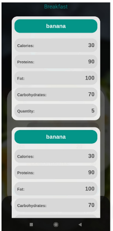
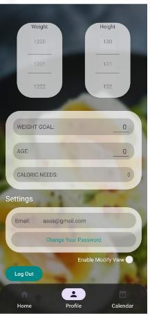

# Karori 2022/2023 - Mobile Fit Application

Gruppo: MELMA <br />
Componenti Gruppo: <br />
Monti Lorenzo 869960 <br />
Oltolini Edoardo 869124 <br />
Gherardi Marco 869138 <br />
Lombardo Matteo 869232


## 📱 Project Overview

**Karori** is a mobile application developed as an academic project within the context of Mobile Application Development. The app aims to provide a user-friendly platform for searching, viewing, and count the kilocalories , leveraging external APIs for data retrieval and backend services for authentication and data persistence.

## 🧩 Project Design Phases

### 1. Requirements Analysis and Use Cases

During the initial phase, we conducted a thorough requirements analysis, leading to the definition of **use cases**. Specifically, we identified various **actors** (User, System, External Services) and their interactions, clearly outlining all **«include» relationships** to represent shared behaviors among use cases.


We started from a conceptual idea, which served as the foundation for the design and functional development of the application.
The following three images represent the initial prototype, which guided the implementation of the core features and user experience of the app.

<p align="center">
  
  
  
</p>

### 2. System Architecture

The application was designed following a modular and scalable architecture based on:

- **Activities and Fragments**: for managing the user interface and screen navigation.
- **ViewModel**: for handling UI-related logic and state independently from the UI lifecycle.
- **Repository**: to abstract the data sources (remote/local) and enforce separation of concerns.

### 3. MVVM Architectural Pattern

The app follows the **MVVM (Model-View-ViewModel)** pattern to ensure a clear separation of responsibilities and simplify testing. This approach enables effective state management and responsive UI updates.

### 4. Components and Utilities Used

- **Custom Listeners**: for managing events and callbacks between components.
- **Adapters**: for binding data to RecyclerViews.
- **Factory Classes**: for controlled instantiation and initialization of ViewModels.

### 5. Integration with External Services

The app integrates several external APIs and backend services, including:

- **Spoonacular API**: for retrieving dynamic content such as recipes, ingredients, and nutritional information.
- **Firebase (Authentication & Firestore)**: for user management, authentication, and storage of saved recipes.

## 🖼️ Main Screens Overview

### 🔐 **Login / Registration**
The user enters their credentials—email and password—or logs in via their Google account, unless they have previously authenticated.
If a login was already performed in a past session, the system automatically logs the user in by loading the previously stored session data.

The user can log out at any time through the “Settings” section of the application. Logging out will clear all information related to automatic login, effectively resetting the authentication state.


### 🍽️ **Home (Diet-Friendly Recipes)**

<p align="center">
  
  
</p>

This screen displays a daily summary divided into three main meals: Breakfast, Lunch, and Dinner.
Users can switch between these meal sections by swiping left or right across the screen.

The “See more” button allows users to view the specific foods that contributed to the nutritional values shown on the screen.
Upon clicking, a pop-up window appears listing the consumed items. By selecting an individual food item, the app navigates to a detailed view that provides more specific nutritional data.

The “Add” button enables users to search for a food item they have consumed and add it to one of the three respective meal lists (Breakfast, Lunch, or Dinner).

At the top of the screen, the application logo dynamically displays the total calories consumed, calculated according to a previously defined formula.

### 🔍 **Search and Nutrition Information Flow**

<p align="center">
  
  
</p>

In the Search screen, a user can look for a specific food item to add to a selected meal (Breakfast, Lunch, or Dinner).
Upon selecting a food, the application first prompts the user to enter the quantity, followed by a screen to choose the appropriate unit of measurement.

Alternatively, the user can also search for a recipe, and from there, view the list of ingredients it contains.

In the Information screen, if a user has selected a food item, they can view both primary nutritional values—Calories, Carbohydrates, Proteins, and Fats—as well as glycemic properties and secondary nutritional details, such as Vitamins, Zinc, Iron, and more.

Once reviewed, the user can add the selected food item to the chosen meal using the “Add Aliment” button. This action stores the data locally via Room, the app’s local database component.

### ⚙️ **User Profile**
In this screen, the user can view all their personal information, including:
Height
Weight
Age
Goal
Daily Caloric Intake (kcal)
Email address



All these values can be manually updated using a dedicated edit button, which enables the user to overwrite the existing data and update the changes in the database. The caloric intake is calculated using the same formula applied during the login/registration phase.
Another feature available in this section is the ability to change the password. By pressing the corresponding button, an email will be sent to the user’s registered address, containing a link to reset the password securely.
Finally, the screen also includes a Logout button, which signs the user out and redirects them to the Login screen.
A toggle switch is present to enable or disable editing mode, allowing the user to make changes only when necessary.


## 🔧 Technologies Used

- **Language**: JAVA  
- **Framework**: Android Jetpack (LiveData, ViewModel, Navigation)  
- **Libraries**: Retrofit, Glide, Firebase SDK, Material Design Components  
- **Architecture**: MVVM  
- **Backend**: Firebase Firestore  
- **External API**: Spoonacular API  

## 🚀 Installation Instructions

1. Clone the repository:
   ```bash
   git clone https://github.com/LolloMagicMagia/Karori.git

## ⚠️ Application Status
This application is currently deprecated and no longer maintained.

At the time of development, it relied on the integration of two key external services:

Spoonacular API – for retrieving nutritional data, recipe details, and ingredient information.

Firebase – for user authentication, real-time data storage, and password recovery functionality.

## 🎓 Educational Approach and Development Philosophy
This project makes use of Android’s Navigation Component, specifically the Navigation Graph, to manage transitions between fragments in a structured and scalable way. Each navigation action is clearly defined within the graph, improving both readability and maintainability of the app's flow.

While not all components and design patterns strictly contributed to functionality or were necessary for the app’s scope, we intentionally chose to implement all the key elements taught during the course. The purpose was to challenge ourselves by experimenting with different architectural patterns and best practices—even in cases where simpler alternatives may have sufficed.

This includes, but is not limited to:

MVVM architecture (Model–View–ViewModel)

ViewModel + LiveData for state management

Repository pattern for data abstraction

Listeners, Adapters, and Factory classes

Integration with Firebase and external APIs (Spoonacular)

Room database for local persistence

Navigation Graph for in-app routing
